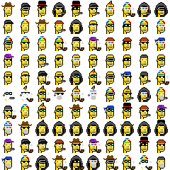
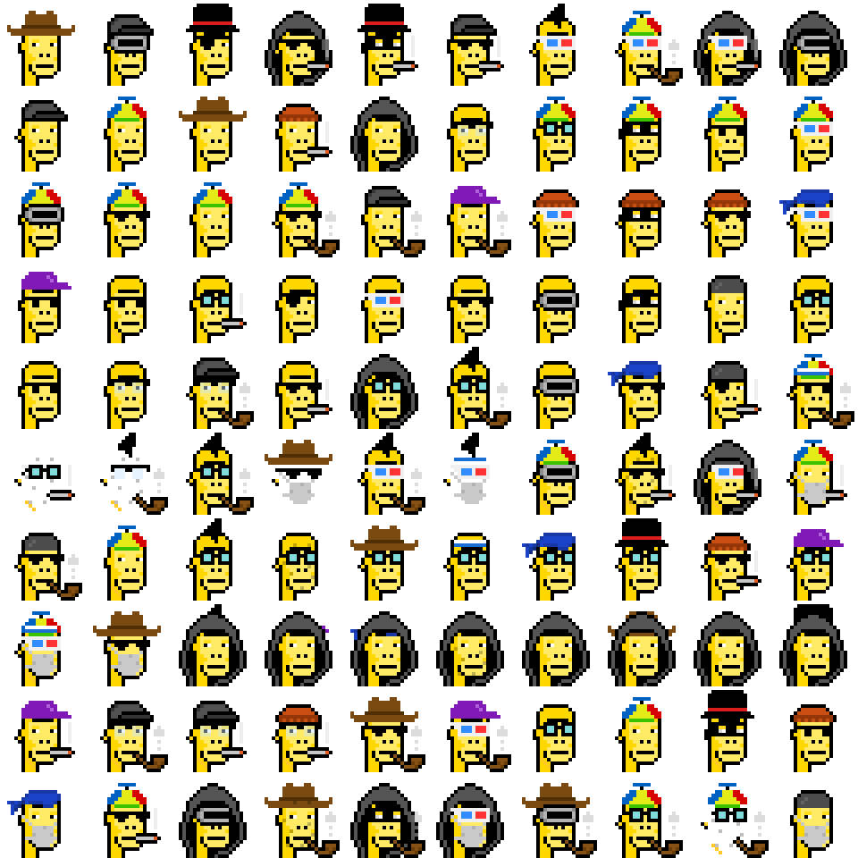
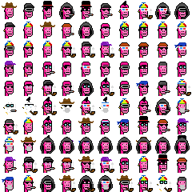
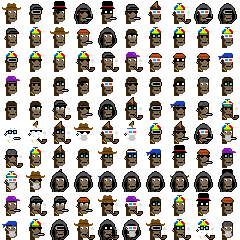
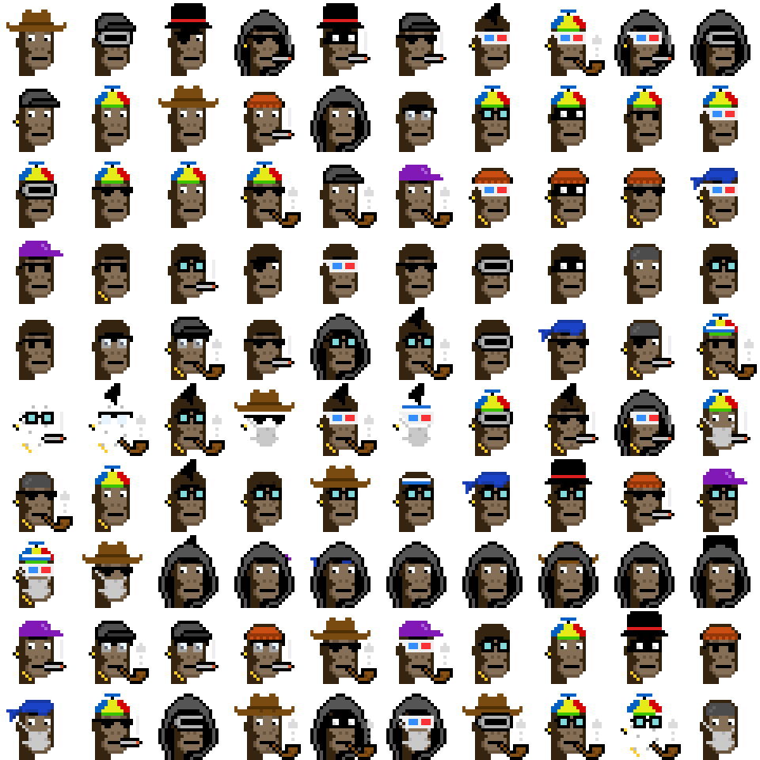

# Ordgen / ORC-721 Sandbox


## D.I.Y. (Recursive) Apes

Attribute Dataset - [diyapes.csv](diyapes/diyapes.csv)

```
id, type, accessories
0, Ape, Cowboy Hat
1, Ape, Cap Forward / VR
2, Ape, Eye Patch / Top Hat
3, Ape, Hoodie / Earring / Cigarette / Regular Shades
4, Ape, Cigarette / Top Hat / Eye Mask
5, Ape, Regular Shades / Cigarette / Cap Forward
6, Ape, Mohawk / Earring / 3D Glasses
7, Ape, Beanie / Earring / Pipe / 3D Glasses
8, Ape, Hoodie / 3D Glasses / Cigarette / Earring
9, Ape, VR / Hoodie
10, Ape, Cap Forward / Earring
...
```

Variant No. 1  -  Gold(en)



<details>
<summary markdown="1">4x</summary>



</details>


Variant No. 2  -  (Deep) Pink



<details>
<summary markdown="1">4x</summary>


</details>


Variant No. 3  -  Natural (w/ Big Eyes)



<details>
<summary markdown="1">4x</summary>



</details>


## Questions? Comments?

Join us in the [Ordgen / ORC-721 discord (chat server)](https://discord.gg/dDhvHKjm2t). Yes you can.
Your questions and commetary welcome.


Or post them over at the [Help & Support](https://github.com/geraldb/help) page. Thanks.


